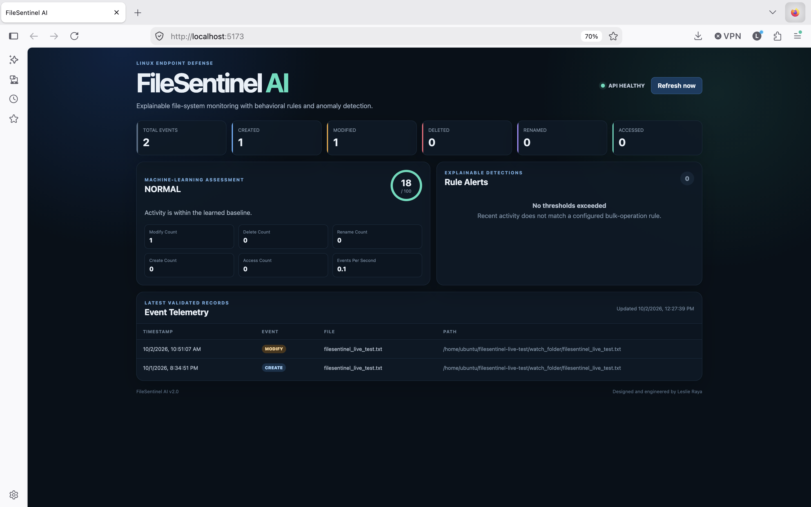

# FileSentinel AI

FileSentinel AI is a file-system monitoring and anomaly-detection project. It combines a Linux monitoring agent, a FastAPI backend, and a React dashboard to display file events and flag suspicious patterns.

The project uses behavioral rules to detect bulk file operations and an Isolation Forest model to assess unusual activity.

## Features

- Captures file creation, modification, deletion, rename, and access events on Linux.
- Records captured events in CSV format.
- Displays event counts and individual records in a React dashboard.
- Flags bursts of modifications, deletions, renames, and creations.
- Provides machine-learning anomaly assessments.
- Includes interactive API documentation and health checks.
- Provides a synthetic event simulation script and automated tests.

## Screenshots

### Dashboard

Displays file activity, anomaly assessments, and rule alerts.


### API Documentation

Interactive documentation for the backend endpoints.


### Health Check

Shows backend status and readiness of the event store and model.


### Linux Agent Verification

The Linux agent captured CREATE and MODIFY events for a test file.
The event log was manually copied from a Linux VM to the Mac and
displayed on the dashboard.

The dashboard showed two events, a normal assessment, and zero rule alerts.



[Browse all screenshots](docs/images-filesentinel)

## Tech Stack

| Component | Technologies |
| --- | --- |
| Monitoring agent | C, Linux inotify |
| Backend | Python, FastAPI |
| Data processing | pandas, NumPy |
| Machine learning | scikit-learn, Isolation Forest, joblib |
| Frontend | React, JavaScript, Vite |
| Testing | pytest |
| Version control | Git, GitHub |

## Project Structure

| Location | Purpose |
| --- | --- |
| `agent/` | Linux monitoring agent, Makefile, and instructions |
| `backend/` | API, event processing, and detection logic |
| `data/` | Event CSV files |
| `frontend/` | React dashboard |
| `ml/` | Training code, model artifacts, and metadata |
| `scripts/` | Simulation and utility scripts |
| `Automated tests/` | Python test suite |
| `docs/images-filesentinel/` | Project screenshots |
| `README.md` | Main project documentation |

## How It Works

1. The Linux agent watches a selected directory for file activity.
2. Captured events are written to a CSV file.
3. The backend reads event data and calculates activity statistics.
4. Behavioral rules check for bulk-operation patterns.
5. The machine-learning model assesses activity features for anomalies.
6. The dashboard displays the backend results.

The agent and backend must have access to the same event data.
When they run in separate environments, the CSV must be explicitly
shared or transferred.

## Requirements

- Python and pip
- Node.js and npm
- Git
- Linux, GCC, and Make for the monitoring agent

The C monitoring agent requires Linux because it uses inotify.
On macOS, run the agent inside a Linux virtual machine, such as a
Multipass instance. The backend and frontend can run separately on the Mac.

## Get Started

Clone the repository:

```bash
git clone https://github.com/leslieraya555/FileSentinel-AI.git
cd FileSentinel-AI
```

If you already have the project, open its existing main directory instead.

### 1. Set Up the Backend

From the main project directory:

```bash
python3 -m venv .venv
source .venv/bin/activate
python -m pip install -r backend/requirements.txt
```

### 2. Start the Backend

From the main project directory:

```bash
.venv/bin/python -m uvicorn backend.main:app --reload --port 8000
```

Leave this terminal running.

Open the interactive API documentation:

http://localhost:8000/docs

### 3. Start the Frontend

Open another terminal in the main project directory:

```bash
cd frontend
npm install
npm run dev
```

Leave this terminal running.

Open the URL printed by Vite, normally:

http://localhost:5173

### 4. Generate Simulated Events

Open another terminal in the main project directory:

```bash
.venv/bin/python scripts/test_simulation.py
```

The simulation appends synthetic records to `data/events.csv`.
It includes normal activity and bursts intended to exercise the
detection rules. It does not perform the described file operations
on real files.

Refresh the dashboard to inspect event counts and alerts.
Repeated runs add more records.

## Run the Linux Monitoring Agent

Run these commands inside Linux, starting from the main project directory:

```bash
make -C agent
mkdir -p watch_folder data
./agent/monitor watch_folder data/events.csv
```

Leave the monitoring terminal running while creating or modifying
test files in `watch_folder`.

See the [agent README](agent/README.md) for detailed setup,
file-operation tests, and troubleshooting.

### Display a Copied Linux Event Log

For the verified Mac demonstration, the Linux event log was manually
copied into the Mac project as `data/live-events.csv`.

Once that file exists, stop the existing backend with Control+C.
Then run this command from the main project directory:

```bash
FILESENTINEL_EVENTS_FILE="$PWD/data/live-events.csv" .venv/bin/python -m uvicorn backend.main:app --reload --port 8000
```

Refresh the dashboard to display the copied records.

This is a snapshot workflow. New events captured in the Linux VM
require another transfer before they appear on the Mac dashboard.

To return to `data/events.csv`, stop the backend and restart it
with the standard backend command.

## Automated Tests

From the main project directory:

```bash
.venv/bin/python -m pytest "Automated tests" -q
```

If pytest is not installed:

```bash
.venv/bin/python -m pip install pytest
```

Then run the test command again.

The recorded local test run on October 1, 2026 completed with
**12 passed and 2 dependency deprecation warnings**.

## Verification Results

| Check | Observed result |
| --- | --- |
| Automated tests | 12 passed in the recorded local run |
| Synthetic event simulation | Events appeared on the dashboard |
| Behavioral detection rules | Simulation produced four rule alerts |
| Linux agent compilation | Compiled successfully in a Linux VM |
| Real file activity | CREATE and MODIFY events were captured |
| Backend and dashboard integration | Displayed two captured Linux events after manual CSV transfer |

These results describe local verification. GitHub Actions results
must be checked separately.

[View GitHub Actions](https://github.com/leslieraya555/FileSentinel-AI/actions)

## Model Training

From the main project directory:

```bash
.venv/bin/python ml/train_model.py
```

The training script:

- Uses a fixed random seed for reproducible dataset generation and fitting.
- Fits an Isolation Forest model on synthetic normal activity.
- Evaluates it using separate synthetic normal and attack-like examples.
- Writes the model to `ml/model.pkl`.
- Writes validation metrics and metadata to `ml/model_metadata.json`.

Running training overwrites these artifacts. Restart the backend
after replacing its model.

Synthetic validation metrics do not establish real-world detection
accuracy. Model behavior requires further evaluation with representative
file-system activity.

## Troubleshooting

### Port 8000 Is Already in Use

An existing process may already be running the backend.
Stop the existing backend in its terminal with Control+C before
starting another instance on the same port.

### Dashboard Cannot Connect to the API

Confirm that the backend is running on port 8000 and that its terminal
shows successful startup. Check the browser and backend logs for errors.

### Expected Events Do Not Appear

Confirm that:

- The agent was running when the file operation occurred.
- The operation occurred inside the monitored directory.
- The event was recorded in the CSV.
- The backend is reading the intended CSV.
- A new transfer was completed if using the VM snapshot workflow.

### The Agent Does Not Compile on macOS

Compile and run the agent inside Linux. The Linux inotify headers
are not available natively on macOS.

### README Images Do Not Display

Confirm that image filenames and folder paths match the Markdown
links exactly, including capitalization. Commit and push the image
files together with the README changes.

## Limitations

- The monitoring agent requires Linux.
- It watches one directory without recursively monitoring subdirectories.
- Events are captured only while the agent is running.
- Manual CSV transfer does not provide continuous synchronization.
- Synthetic training data requires calibration against representative activity.
- An anomaly or rule alert is a reason to investigate, not proof of malware.
- Displayed risk scores are not validated probabilities of infection.
- The project does not automatically block processes or recover deleted files.

## Author

**Leslie Raya**

- [GitHub profile](https://github.com/leslieraya555)
- [Project repository](https://github.com/leslieraya555/FileSentinel-AI)