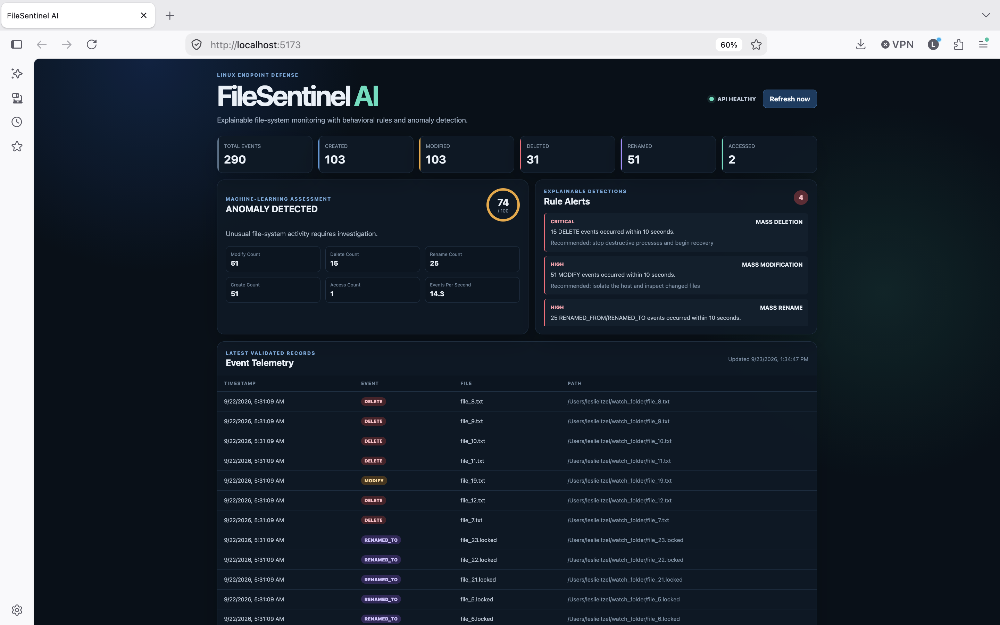
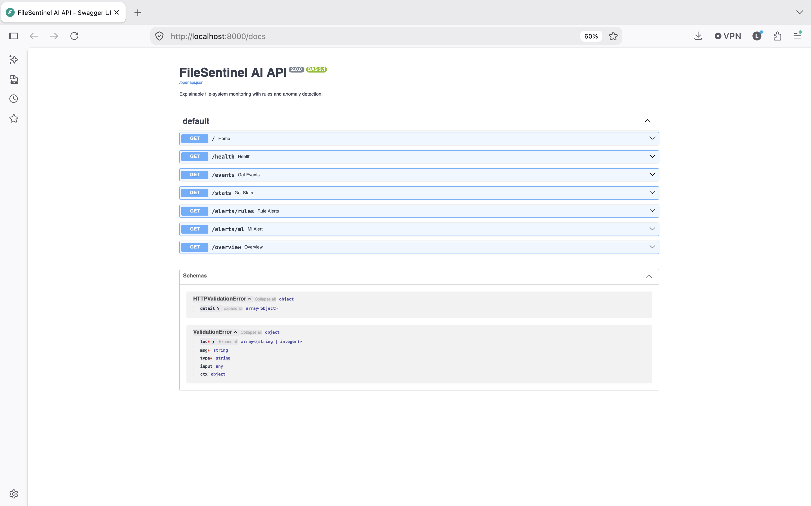
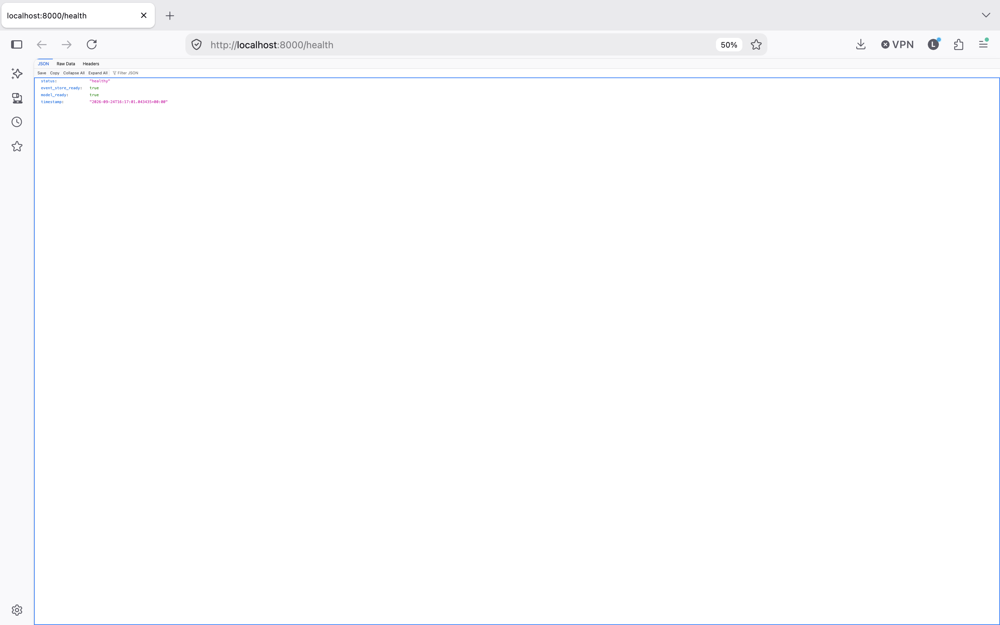

# FileSentinel AI

FileSentinel AI is a cybersecurity monitoring system that tracks file-system activity and detects suspicious patterns such as rapid file modifications, deletions, renames, and ransomware-like behavior. It combines a FastAPI backend, React dashboard, machine learning anomaly detection, and rule-based alerts to visualize file events, risk scores, and security warnings.

## Screenshots

### Dashboard

Displays file activity and detection results.



### API Documentation

Lists the available backend endpoints.



### Health Check

Shows backend status and readiness of the event store and model.



[View all screenshots](docs/images-filesentinel)


## Features

- Monitors file-system event data
- Detects ransomware-like activity patterns
- Uses machine learning anomaly detection with scikit-learn
- Uses rule-based cybersecurity alerts
- Displays risk status and event statistics in a React dashboard
- Provides FastAPI endpoints for health checks, events, stats, ML alerts, and rule alerts
- Includes a safe simulation script for testing suspicious file activity

## Tech Stack

- Python
- FastAPI
- pandas
- scikit-learn
- React
- JavaScript
- Vite
- C
- Git/GitHub

## Project Structure

```text
FileSentinel AI/
├── agent/
├── backend/
├── data/
├── frontend/
├── ml/
├── scripts/
├── README.md
├── .gitignore
└── docker-compose.yml
cd backend
python3 -m uvicorn main:app --reload
cd frontend
npm install
npm run dev
python3 ml/train_model.py
python3 scripts/test_simulation.py
